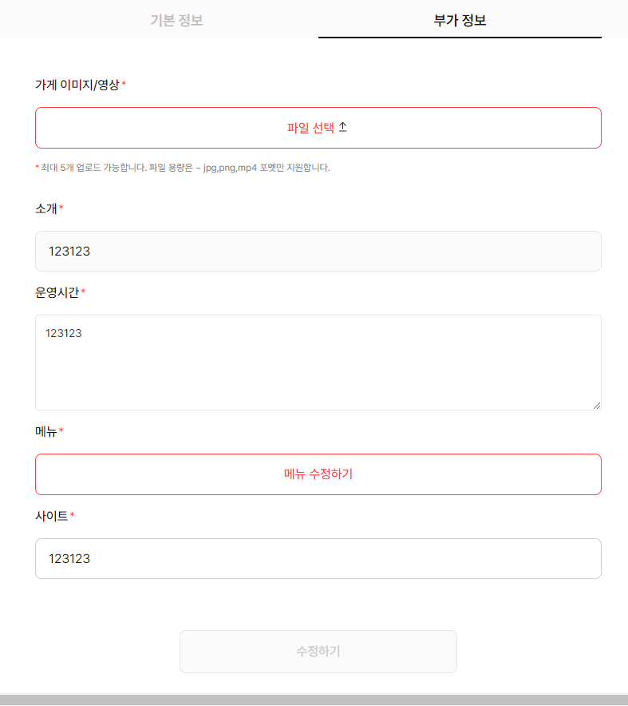

# EzenRoad
# <p align="center"></p>
# EzenRoad v1
> 이젠아카데미 풀스텍반 + UI반 협업프로젝트
# 배포주소
> 도메인
>
> <a href="http://www.ezroad.kr/">www.ezroad.kr</a>
***
# 개발자 소개
|이 재권|
|------|
||
# 프로젝트 소개
> 지역 맛집을 찾는 보다 편한 검색 및 이용자들의 자유로운 맛집 커뮤니티 생성
***
# 시작 가이드
**Requirements**

For building and runnig the application you need.
- Spring Tool Suite 3.9
- apache tomcat9


**Installation**

```
$ git clone https://github.com/ahnhyogeon/TeamProject
$ cd TeamProject
```
# 📚 STACKS
         
# 주요 기능

1. 식당 점주의 식당 등록
2. 등록된 식당을 통하여서 이용자가 예약 및 테마 설정
3. GPS를 이용한 현재 위치 근처의 식당 소개
----
# 화면구성
> 메인페이지

 |메인1|메인2|
 |---|---|
 |||

 |메인3|메인4|
 |---|---|
 |||

> 관리자 페이지

 |관리자1|관리자2|
 |---|---|
 |||

 |관리자3|관리자4|
 |---|---|
 |||

> 고객

 |리뷰|테마|예약|
 |---|---|---|
 ||||

> 사업자
 
 |가게소개|메뉴관리|리뷰관리|
 |---|---|---|
 ||| |


